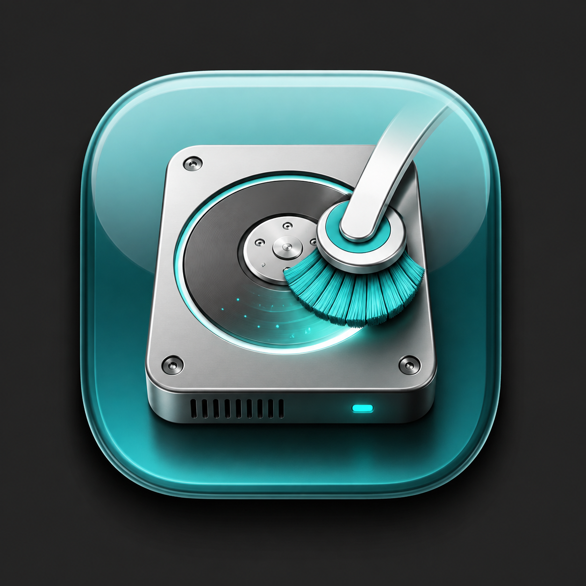
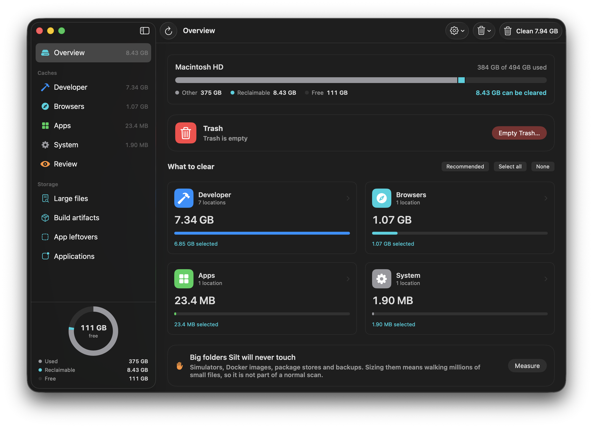

# Silt

Silt is what settles on a disk. This clears it.

A small, deliberately boring macOS disk cleaner. SwiftUI, no dependencies, no network access,
no background agent, no "1 GB of junk found!" theatre.




## What it does

**Caches.** Measures [123 known cache and log locations](docs/catalog.md) across 25+ language
ecosystems: npm, Gradle, Maven, Cargo, pip, uv, Poetry, Conda, CocoaPods, Composer, Bundler,
NuGet, Hex, opam, Cabal and the rest. Every location carries a plain-language line about what
happens if you clear it, and the tool's own prune command where one exists.

**Build artifacts.** Finds `node_modules`, `.venv`, `Pods`, `target`, `vendor`, `.next`,
`elm-stuff`, `_build` and friends across your projects. A folder only counts when its marker
file sits beside it, so a `target` directory without a `Cargo.toml` is left alone. Rows show
when the project itself was last touched, which is usually what tells you it is safe to drop.

**Large files.** Everything over a threshold you pick, sorted by size, classified by what it
is: video, archives, disk images, binaries (detected down to the Mach-O magic number),
documents. Bundles like `.app` and `.photoslibrary` count as one item instead of thousands.

**Applications.** An icon grid of what is installed, with size and last-opened date, search
and filters. Uninstalling takes the app's Application Support, caches, preferences,
containers and login items with it, matched on bundle id.

**App leftovers.** Data from apps you already deleted, across eleven per-user Library
locations. Reverse-DNS matches with no installed app are removable; bare-name guesses are
shown but locked, because a Homebrew-installed tool has no `.app` to prove it is still there.

**Things it refuses to delete.** Simulators, Docker images, package stores, backups. Shown
with their size and the correct native command instead of a delete button.

A normal scan takes about one second and the first result appears in milliseconds. The
measurements behind that are in [docs/performance.md](docs/performance.md).

## Install

```bash
brew install --cask thabti/tap/silt
```

Signed but not yet notarized, so right-click and choose Open on first launch. The dmg is also
on the [releases page](https://github.com/thabti/silt/releases).

Requires macOS 14 or later, Apple silicon.

## Safety

Three independent gates stand in front of every removal. The first is a hand-written catalog
allow-list, so paths cannot enter the pipeline from anywhere else. The second is a review-only
kind that the cleaner re-checks on its own. The third is a set of per-path `SafetyGuard` rules
covering home-folder containment, a protected-location denylist over Documents, Desktop,
`~/.ssh`, Keychains, iCloud Drive and Photos, no symlink following, and no `..` traversal.

Cleaning moves things to the Trash by default, so you can put them back. Permanent deletion
is a separate mode you have to pick. Folders stay in place and only their contents are
cleared, because apps expect their own cache directory to exist. Hand-picked files and
uninstalled apps always go to the Trash.

The protected-location list can be switched off in Settings. While it is off, every page
carries a warning banner and the toolbar icon turns red, and the structural rules stay on.

28 tests cover the guard, including one that walks the whole catalog and asserts every
deletable entry passes and every review entry does not. Full details in
[docs/safety.md](docs/safety.md).

## Permissions

Silt asks for nothing at launch and works without any of these:

- **Full Disk Access** lets it read Safari's cache and app containers. Without it those show
  as *Partly locked* rather than being silently under-counted.
- **App Management** is what macOS requires before any app can move another app out of
  `/Applications`. Without it, uninstalling reports a blocked result with a button to the
  right settings pane.
- **Finder automation** is the fallback when App Management is off. Finder is always allowed
  to trash an application, so Silt asks it to do the move.

The app is not sandboxed, deliberately. A sandboxed app cannot read another app's caches.

## Building from source

```bash
git clone git@github.com:thabti/silt.git
cd silt
brew install xcodegen          # once
make run                       # generate project, build, launch
```

`Silt.xcodeproj` is generated from `project.yml` and git-ignored, so edit `project.yml` rather
than the project file. Local builds are unsigned: no team, no provisioning, nothing to
configure. For Xcode, run `make generate` and open the project.

`make help` lists the rest: `test`, `signed`, `dmg`, `release` (sign, notarize, staple),
`docs`, `icon`.

## Documentation

| | |
|---|---|
| [Architecture](docs/architecture.md) | catalog to scanner to index to cleaner, and why |
| [Safety model](docs/safety.md) | the three gates and the exact guard rules |
| [Catalog reference](docs/catalog.md) | all 123 locations, generated from the source |
| [Performance](docs/performance.md) | 96s to 1s, measured, and what was rejected |
| [Design language](docs/design.md) | the System Settings reference, light and dark |
| [Development](docs/development.md) | building, testing, adding locations |
| [Releasing](docs/releasing.md) | signing, notarizing, the Homebrew tap |

## Layout

```
Sources/Silt/
  Models/       catalog (the allow-list), scan types, file and leftover classification
  Services/     SafetyGuard, the four scanners, Cleaner, TrashService, DiskSpace
  ViewModels/   AppModel: all state, plus a pre-aggregated ScanIndex the views read
  Views/        overview, category detail, large files, artifacts, leftovers,
                applications, capacity ring, sheets
  Design/       theme: one teal accent, system palette, flat cards
Tests/SiltTests/  guard rules, catalog integrity, classification
docs/             the documentation above, plus the catalog generator
Icon/             icon artwork and its generator script
project.yml       source of truth for the Xcode project
```

Personal project, built in the open. No license file yet, so all rights reserved for now.
