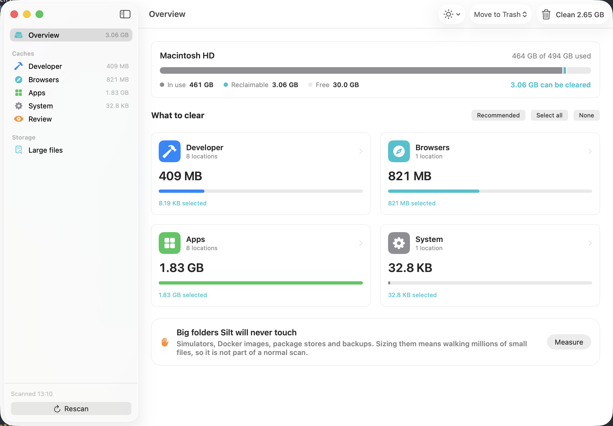

# Design language

The reference is **System Settings › Storage**. The first iteration had the statistical-average
"AI app" look — indigo-to-violet gradients, glow shadows, rounded display type, gradient icon
tiles — and was rejected wholesale. What replaced it:

## Rules

- **One accent.** `systemTeal`, matching the teal of the app icon. Nothing else gets brand
  color. Icon tiles darken that tint and pick their glyph colour by luminance, because six
  of the ten system colours fail 3:1 against white.
- **System palette for everything else.** Category and file-kind tints come from
  `NSColor.system*`, so light/dark adaptation is free and the hues are Apple's, not a model's.
- **Flat.** Grouped-inset cards (`controlBackgroundColor`, hairline stroke, radius 10), solid
  `IconTile` squares, a flat segmented capacity bar. No gradients, no glow, no drop shadows.
- **System typography.** SF Pro at native sizes, `.monospacedDigit()` wherever numbers align.
- **Actions live in the toolbar** — mode picker plus a `trash`-icon Clean button — not in a
  floating bottom bar.
- **Honest icons.** Clean is a trash can. Success is a checkmark. No sparkles.
- **Appearance** (System / Light / Dark) is a toolbar menu, `@AppStorage`-backed, applied via
  `preferredColorScheme`.

Do not reintroduce purples, gradients, glow, or sparkles. If a new element needs a color,
take it from the system palette; if it needs an effect, it probably doesn't.

## Screens

| Dark | Light |
|---|---|
|  |  |
